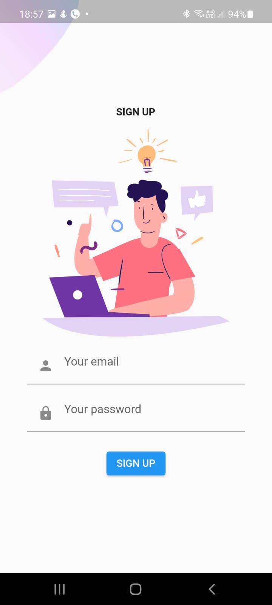
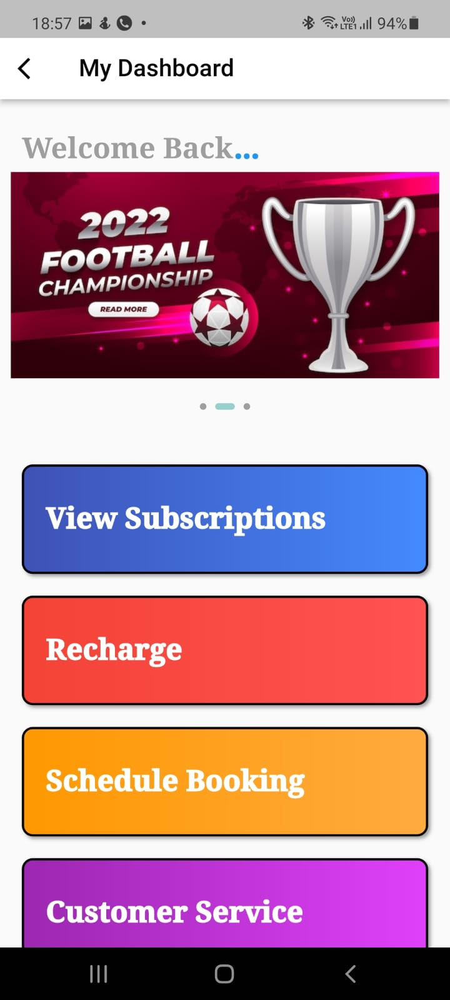
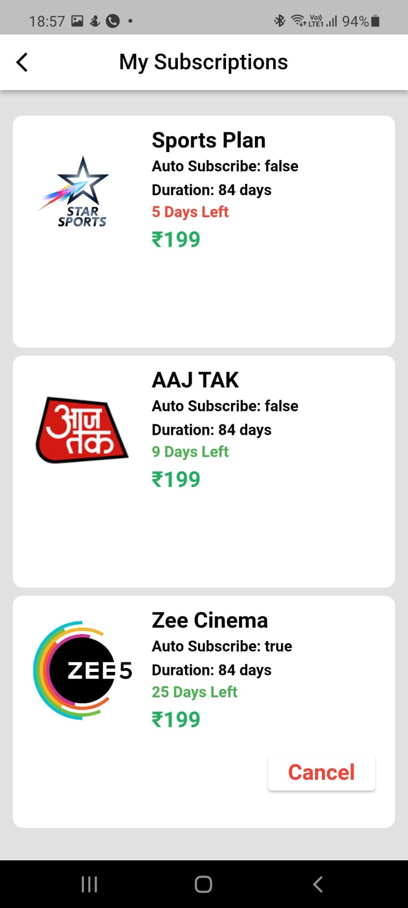
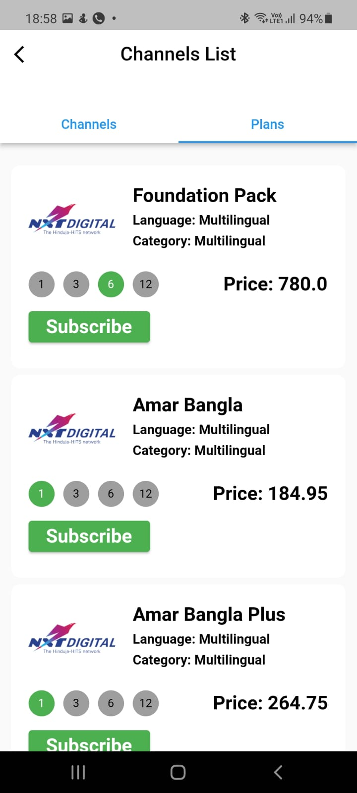
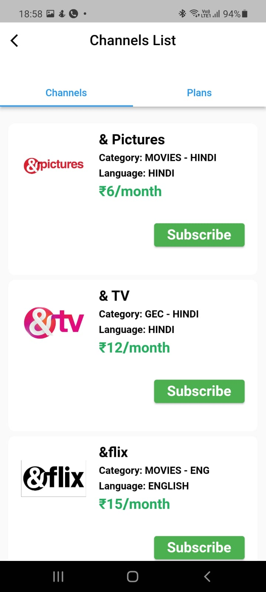
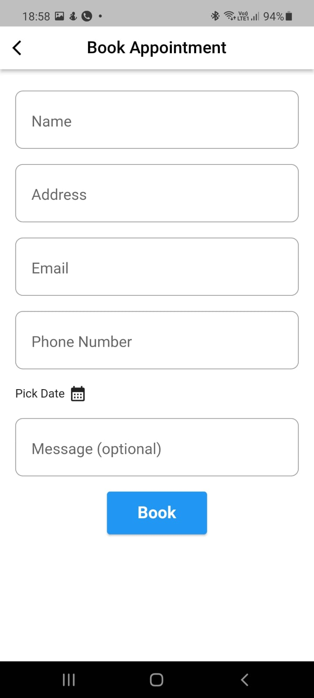
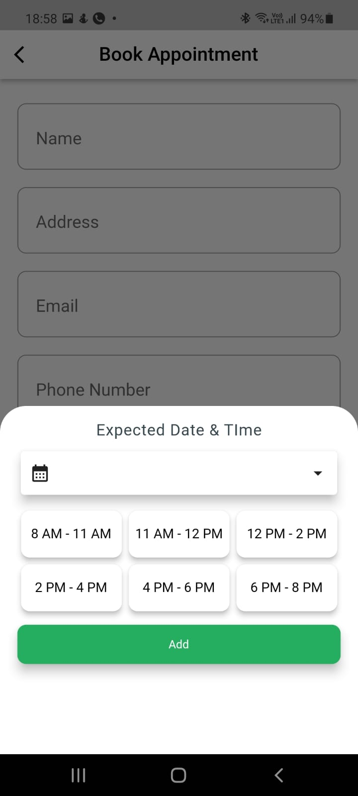
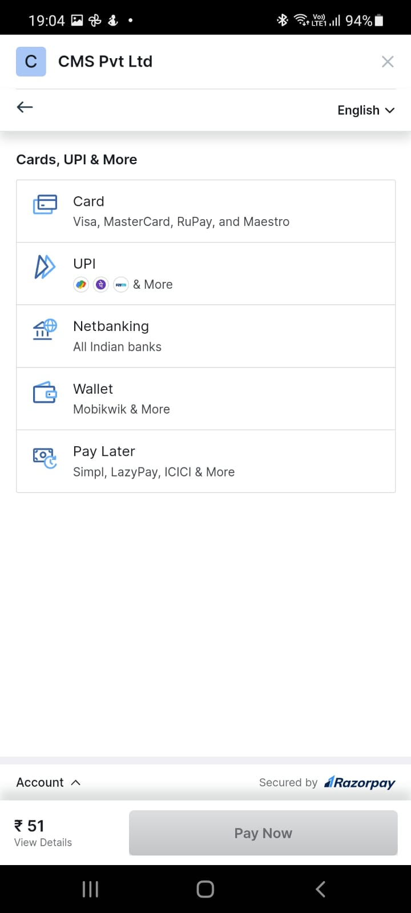

## Cable Management System

<!-- ABOUT THE PROJECT -->
## About The Project

The CMS aims to provide a great user experience to users by allowing them to conveniently 
perform their cable TV recharge from their home by 2 simple steps. There are different 
features like channel recommendation system, user review and in-depth description about 
each TV channels, and comparison between different plans of service providers, and in-time 
renewal emails

**Tech Stack Used** 

## App Screenshots

## Admin Screenshots

